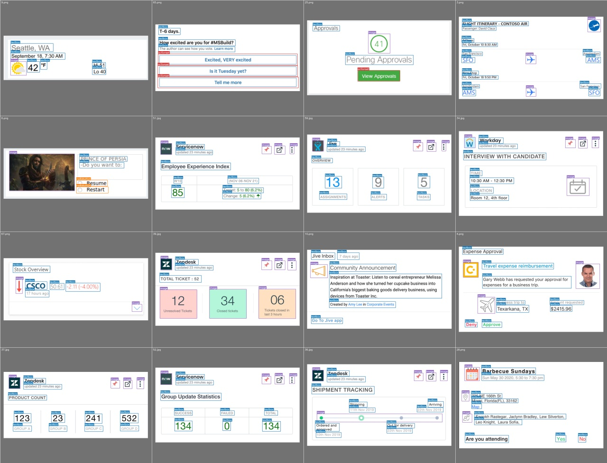
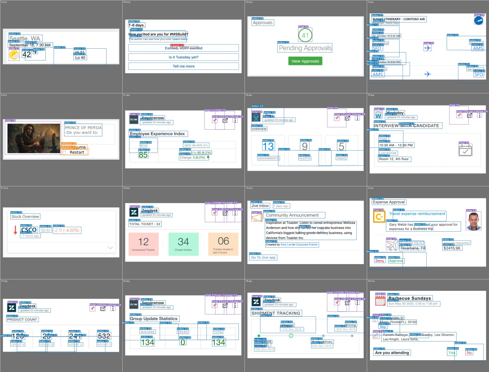

# pic2card_yolov5
Implementation of YOLOv5 on pic2card dataset. 

**Configuring Virtual enviroinment**

Activate an virtual env using pipenv and install the dependencies from the pipfile

`pipenv shell`

`pipenv install`

**Running Inference**

To run inference on give the path of test images under the source and use the weight file. The output will be stored under the inference in an output folder. 

`python detect.py --source ./inference/images/ --weights ./weights/best_secondrun.pt`

**Running Test**

Run this command to get the parameters on how the weights are performing for a particular data.

`python test.py --weights ./weights/best_secondrun.pt --data ./data/pic2card_dataset.yaml`

Configure the yaml file to add the input image folder path. 

*Ground Truth*

*YOLO predictions*

